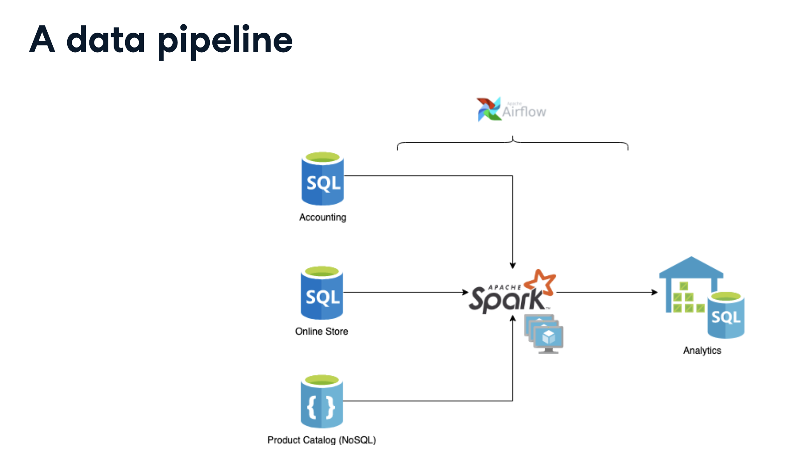
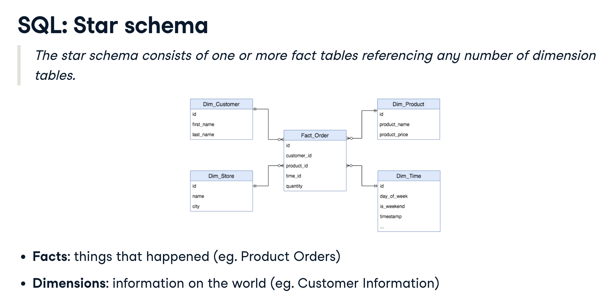

# Course: Understanding Data Engineering

## The Data Workflow

1. Data collection and storage (Data Engineer)
2. Data Preparation (Data Scientist)
3. Exploration and Visualization (Data Analyst)
4. Experimentation and Prediction (Data Scientist)

## Data Engineer Responsibilities

* Ingest data from various sources. (Build and maintain Data Pipelines)
* Optimize database for analysis.
* Remove corrupted data.
* Develop, construct, test and maintain data architecture.

## The Data Pipeline

A data pipeline moves "raw data"into various staging locations in order for ETL process framework to take place. ETL is a data pipeline framework that stands for Extract, Transform and Load.

## Data Structures

Data Structures represent both excel, csv style formats as well as the relational database which can be queried using SQL. Data structures can also have relationships which in turn create links between data sources.

Semi-structured data is relatively easy to search and organize but work is needed to extract value and create relationships. Examples include JSON, XML and YAML (NoSQL).

Unstructured data is data that cannot be contained in rows x columns. Usually this can be text, sound, videos, images etc.

Note that about 20% of data is structured.

## Data Warehouses and Data Lakes

Data Lake:

* Where all raw data, from various sources, is stored.
* Unprocessed and messy.
* Does not enforce a certain data structure; stores all data structures.
* Can be cost effective
* Difficult to analyze.
* Requires an up-to-date catalog.

Data Lakes implement the use of "catalogs" which hold information about the source of the data, where the data is being used, who owns the data and how often the data is updated. Having a catalog is considered best-practice since it introduces a process to Data Lakes.

Data Warehouse (A type of Database)

* Stored specific data for a specific use.
* Stored mainly structured data.
* More costly to update.
* Optimized for analytics.

## Processing Data

Data Processing: converting raw data into meaningful information.

Data Engineers process data by:

* Cleaning data
* storing data in the optimal structure.
* create views on top of database tables.
* Optimize the performance of the database (one option is using indexes)
* Rejecting "bad" data and handling metadata.

## Scheduling Data

In the context of Data Engineering, scheduling refers to small tasks running in a specific order in order to achieve usable data.

Batches refers to grouped data being updated at set intervals. This is often the cheaper option.
Streamed Data refers to individual record updates being sent as soon as any change is made.

## Parallel Computing

The foundation of data processing tools.

Parallel computing is necessary because of memory power and processing power constraints.

How it works:

1. tasks are split into smaller tasks.

Parallel computing pros vs cons

* We get extra processing power and a smaller memory footprint per computer.
* More cost added on since we are now using more resources.
* communication time is required to aggregate smaller tasks results back into main task objective.

## Cloud Computing

Main advantage we see with moving to the cloud is service coverage, db reliability and security.

AWS Specifics:

* File storage: AWS S3
* Computation/Processing: AWS EC2
* Database: AWS RDS

We can also use the multi-cloud model in order to mitigate risk however there can be incompatibility issues and governance risks.

# Course: Introduction to Data Engineering

In it's simplest form, a data pipeline can be thought of as:

It is the role of the Data Engineer to join, clean and organize data before loading it into a destination analytics database.

For this example, Apache Spark is the HUB for all "dirty" data.

All of the commands needed to run are held together using Apache Airflow. Which is the scheduler in this process. Essentially,Airflow makes sure a job runs in a specific order and resolves all dependencies.

## Cloud Providers at a glance

The top 3 services Cloud Providers provide are:

1. Storage services allow us to upload files to the cloud. -  AWS S3
2. Computation - hosting a web server or VM - AWS EC2
3. Databases - hold structured information - AWS RDS

## Databases

One SQL Database architecture that is common to see is the Star Schema. Which by definition is "one or more fact tables referencing any number of dimension tables."

 

## What is Parallel Computing?

The why? Parallel computing at it's simplest core, is the management of memory and processing power.

By "memory" we also mean the partitioning of data into smaller subsets. Therefore, the memory footprint per computer is fairly small.

In other words, we can think of parallel computing as "splitting a BIG task into smaller tasks distributed over several computers."

What are the Risks?

Because we are splitting up a task, there needs to be constant and successfully communication between processes.

## Parallel computing frameworks

Apache Hadoop

* HDFS - a file system that is distributed amongst different computers.
* MapReduce - a big data processing paradigm. Functionality can be easily understood by the "split one BIG task into smaller task" example. The data and workload is distributed between several processing units.

    One flaw of MapReduce is it's challenging to write MapReduce jobs.
* Hive -  a data warehouse software project that provides data querying and analysis.
* Apache Spark - distributes data processing tasks between clusters of computers.
    A main difference between Spark and MapReduce is that Spark will try to maintain as much processing as possible in memory.

## Examining Spark

Spark's framework relies on "Resilient Distributed Datasets (RDD)."

In it's most basic definition form, this just means each dataset is divided into logical partitions which can be then computed on different nodes.

To RDD's we can apply:

1. Transformations `.map()`, `.filter()`.
2. Actions `.count()`, `.first()`.

The programming interface that is uses most commonly with Spark is PySpark. PySpark is the python interface to Spark. PySpark syntax follows closely the "DataFrame abstraction" chaining.

## Workflow scheduling frameworks
